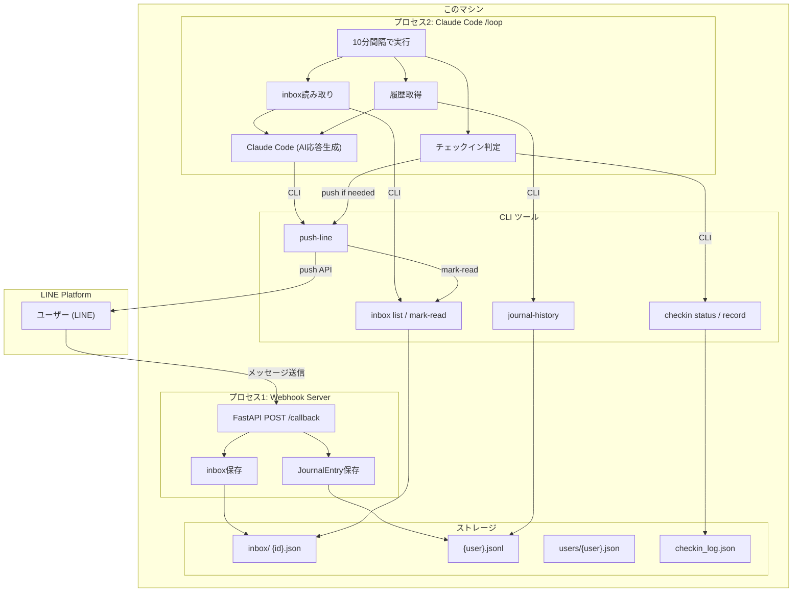
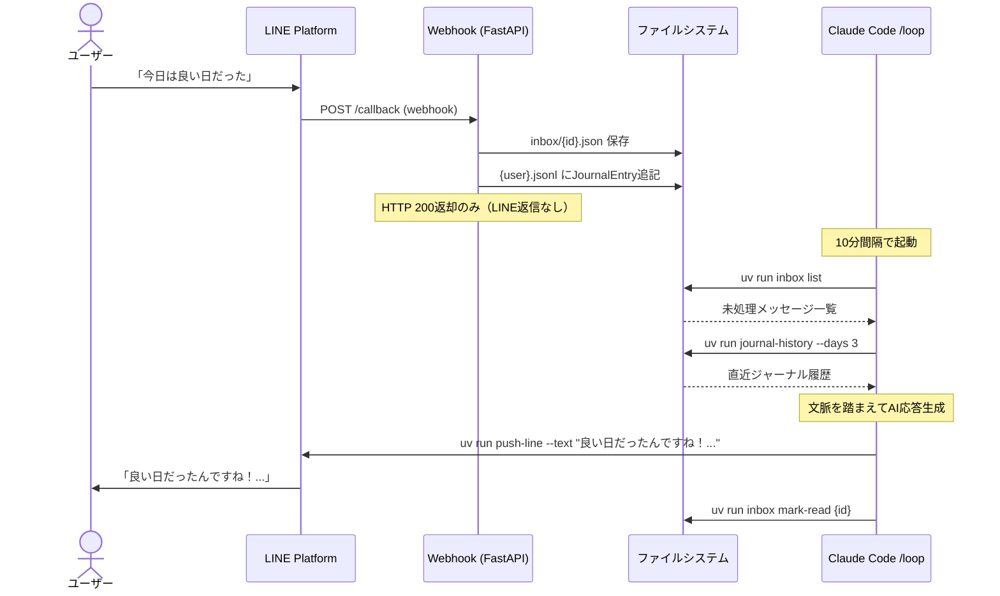
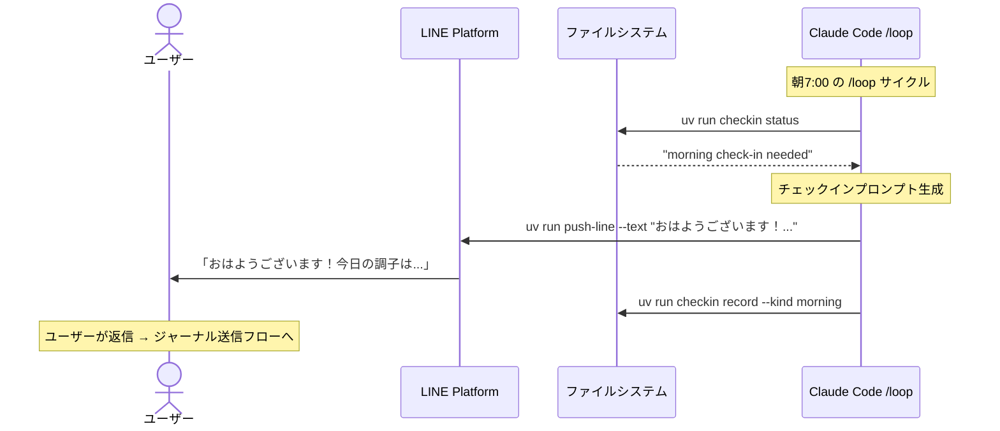

# ADR-0003: 運用アーキテクチャ — Claude Code /loop ベースのAI応答

## ステータス
承認

## 背景
Issue #1-#5でwebhook受信・ルールベース応答が完成した。次のステップとして、AIによる自然な会話応答と能動的なチェックイン促進が必要。

## 選択肢
1. **Anthropic SDK直接呼び出し**: webhookハンドラー内でAPI呼び出し。低レイテンシだがAPI管理が必要
2. **Claude Code /loop ベース**: webhookはinbox保存のみ、Claude Code /loopがAI応答をpushで送信

## 決定
**選択肢2: Claude Code /loop ベース**を採用。

理由:
- Claude Code自体がAIの「脳」として機能し、追加のAPI管理が不要
- /loopプロセスがインボックス監視とチェックイン促進の両方を担当
- MVPではレイテンシ（最大10分）は許容範囲
- ユーザーは1人（開発者自身）のため、スケーラビリティは不要

## アーキテクチャ

## シーケンス図: ジャーナル送信 → AI応答

## シーケンス図: 朝チェックイン

## 影響
- webhookは即時返信しない → ユーザーは最大10分待つ（MVP許容範囲）
- Claude Code /loopの実行にAPIクレジットを消費
- 単一ユーザー前提の設計 → 将来のスケールにはAnthropic SDK直接呼び出しへの移行が必要
